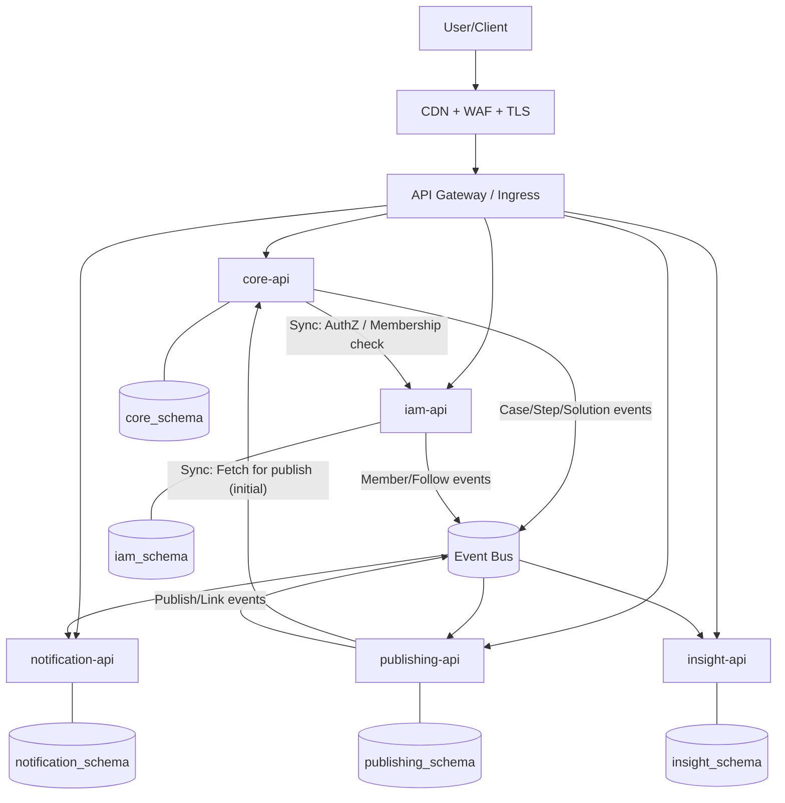
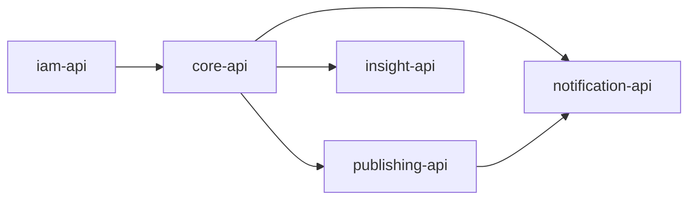

# Error Archive
> 문제 해결 과정을 구조화하여 개인 · 팀 · 커뮤니티의 지식 자산으로 축적하는 플랫폼 <Br>
> 단순 "에러 저장"이 아니라, 시도 / 실패 / 가설 / 해결의 흐름을 타임라인으로 남기고, 상황에 따라 워크스페이스 · 팔로워 · 외부 링크에 공유할 수 있습니다.

<Br>

## Why?
*문제 정의:* <Br>
개발자가 장애/에러를 경험할 때 반복되는 고통은 "원인"이 아니라 "과정"이 사라지는 데서 시작합니다.
- 같은 에러를 몇 달 뒤 다시 겪는다.
- 해결을 했는데, **왜 해결됐는지** 문서화가 부족하다.
- 팀원이 해결한 경험이 **팀의 자산으로 축적되지 않는다**.
- 블로그 / 위키 / 이슈 트래커는 "기록"은 가능하지만, **해결 과정의 구조화**가 어렵다.

<Br>

이 프로젝트는 다음을 목표로 합니다:
- **개인**: "내가 해결했던 문제를 다시 빠르게 재사용"
- **팀**: "팀 단위로 해결 경험을 축적하고 중복 삽질을 줄임"
- **공유**: "필요하면 외부로 제출 가능한 `Artifact` 로 전환"

<Br>

## Key Concepts (핵심 용어)
**Case** / **Timeline**
- Case: 에러 사건의 "헤더 (요약 + 상태 + 분류)"
- Timeline: 해결 과정의 "기록 (Attempt / Failure / Hypothesis / Solution)"

<Br>

**Workspace**
- 팀 단위 협업 / 권한 경계
- 멤버십 / 역할 / 초대 / 설정의 SoT

<Br>

**Visibility** = '누가 볼 수 있나' (Access)
> 팀 기능이 들어오면 private 하나로는 모호해져서 Scope 기반으로 정의합니다.

- `PRIVATE`: 본인만
- `WORKSPACE`: 워크스페이스 멤버
- `LINK-ONLY`: share 링크가 있어야만 접근 가능 (포트폴리오/제출용에 적합)
- `DISCOVERABLE`: 누구나. 노출/검색/추천에 포함

<Br>

## User Scenarios
1) 개인 기록
- 홈에서 빠르게 `케이스 생성` -> `스텝 추가` -> `솔루션 등록`
- 나중에 동일 문제 발생 시 검색/회고로 재사용
- 기존 케이스들을 바탕으로 유사도 기반 자동 추천

<Br>

2) 팀 협업 (Workspace)
- scope를 WORKSPACE로 생성/전환
- 팀 보드에서 케이스를 함께 관리하고 해결 과정이 팀 자산으로 축적

<Br>

3) 팔로워 공유/watch 구독 
- 사용자를 FOLLOW하면 팔로워 피드/알림에 노출
- 특정 에러를 WATCH하면 변경사항이 피드/알림에 노출
- 단, PRIVATE은 팔로워에게 노출되지 않도록 설계

<Br>

4) 외부 공유 (포트폴리오)
- LINK-ONLY로 Publish -> 공유 링크 (share) 생성
- 공개 페이지는 Published Snapshot 기반으로 제공 (원본과 분리)

<Br>

## Architecture Overview
이 프로젝트는 다음 원칙에 따라 아키텍처를 설계했습니다:
- Edge에서 최대한 필터링 및 보호 (WAF/CDN)
- Kubernetes 기반 멀티 서비스 구조
- 서비스 간 장애 전파 차단 (Circuit Breaker)
- 관측 가능성 (Observability) 를 1급 설계 요소로 고려
- 서비스별 데이터 소유권 분리 (DB per Serivce)

<Br>

### Infrastructure Layered View
```kotlin
                  ┌──────────────────────────────────────────────────────────────────────────────┐
                  │                                   Internet                                   │
                  └──────────────────────────────────────────────────────────────────────────────┘
                                                         │
                                                         │ HTTPS (TLS)
                                                         v
                  ┌──────────────────────────────────────────────────────────────────────────────┐
                  │  EDGE                                                                        │
                  │  ┌────────────────┐     ┌────────────────┐     ┌──────────────────────────┐  │
                  │  │ CDN            │ --> │ WAF            │ --> │ TLS Termination          │  │
                  │  │ - cache static │     │ - L7 filtering │     │ (at CDN/ELB/Ingress)     │  │
                  │  │ - ddos absorb  │     │ - bot/rate     │     │ - cert rotation          │  │
                  │  └────────────────┘     └────────────────┘     └──────────────────────────┘  │
                  └──────────────────────────────────────────────────────────────────────────────┘
                                                        │
                                                        │ HTTP/HTTPS
                                                        v
                  ┌──────────────────────────────────────────────────────────────────────────────┐
                  │ Kubernetes Cluster                                                           │
                  │                                                                              │
                  │  Namespace: platform                                                         │
                  │  ┌─────────────────────────────────────────────────────────────────────────┐ │
                  │  │ API Gateway / Ingress Controller                                        │ │
                  │  │ - host/path routing                                                     │ │
                  │  │ - JWT verification or auth delegation                                   │ │
                  │  │ - external rate limit / quota                                           │ │
                  │  │ - trace header propagation                                              │ │
                  │  └─────────────────────────────────────────────────────────────────────────┘ │
                  │                                                                              │
                  │  Namespace: apps                                                             │
                  │  ┌─────────────────────────────────────────────────────────────────────────┐ │
                  │  │  core-api        iam-api        publishing-api                          │ │
                  │  │  notification-api insight-api                                           │ │
                  │  │                                                                         │ │
                  │  │  - REST/gRPC endpoints                                                  │ │
                  │  │  - Resilience4j (timeout/retry/circuit breaker/bulkhead)                │ │
                  │  │  - OpenTelemetry SDK                                                    │ │
                  │  │                                                                         │ │
                  │  │  S2S Discovery: Kubernetes Service + CoreDNS                            │ │
                  │  │  http://service-name.apps.svc.cluster.local                             │ │
                  │  └─────────────────────────────────────────────────────────────────────────┘ │
                  │                                                                              │
                  │  Namespace: observability                                                    │
                  │  ┌─────────────────────────────────────────────────────────────────────────┐ │
                  │  │ Prometheus  ──> Grafana   (metrics)                                     │ │
                  │  │ Loki/ELK     <─ log agent  (logs)                                       │ │
                  │  │ Jaeger/Tempo <─ OTel Collector (traces)                                 │ │
                  │  └─────────────────────────────────────────────────────────────────────────┘ │
                  │                                                                              │
                  └──────────────────────────────────────────────────────────────────────────────┘
                                                      │
                                                      │ private network
                                                      v
                  ┌──────────────────────────────────────────────────────────────────────────────┐
                  │ DATA                                                                         │
                  │  - DB per service (schema separation at least)                               │
                  │  - Redis (cache / lock / rate-limit backing)                                 │
                  │  - Kafka (events / async / outbox pattern)                                   │
                  └──────────────────────────────────────────────────────────────────────────────┘
```

<Br>

### Service-Level View (Logical Context Map)


<Br>

## DDD & Bounded Context 경계 설정 과정
### 논리적 Bounded Context
처음 설계 단계에서는 다음 9개의 BC로 구성:
| Domain Area | Bounded Context | 주요 책임 |
|-------------|----------------|-----------|
| 🔐 Identity | **Identity & Access BC** | - Github OAuth 연동<br>- JWT 발급/검증<br>- 사용자 식별자 관리<br>- 인증 정책 |
| 🔐 Identity | **Profile & Social BC** | - 사용자 프로필 관리<br>- 팔로우/팔로워 관계<br>- 활동 기반 노출 정책 |
| 👥 Collaboration | **Workspace BC** | - 워크스페이스 생성/삭제<br>- 멤버십/역할 관리<br>- 초대 토큰 관리<br>- 팀 단위 권한 정책 |
| 🧠 Core Problem-Solving | **Case Management BC** | - 에러 케이스 생성/수정<br>- 상태 관리 (OPEN / RESOLVED 등)<br>- 태그/분류<br>- Case의 SoT |
| 🧠 Core Problem-Solving | **Resolution Timeline BC** | - Attempt / Failure / Hypothesis / Solution<br>- Root Cause 정의<br>- 타임라인 정렬/버전 관리 |
| 🧠 Core Problem-Solving | **Solution Template BC** | - 해결 패턴 템플릿화<br>- Fork / Save<br>- 재사용 구조 |
| 🌍 Publishing | **Sharing & Publishing BC** | - Visibility 정책 관리<br>- Share Link 생성<br>- Published Snapshot 관리<br>- Public Page 렌더링 |
| 🔔 Event & Interaction | **Notification BC** | - 알림 생성 규칙<br>- Watch / Subscription 관리<br>- 읽음/안읽음 상태 |
| 📊 Insight & Analytics | **Insight & Analytics BC** | - bomb grass (활동 시각화)<br>- MTTR 계산<br>- 반복 에러 분석<br>- 유사도 기반 추천 시스템 |

<Br>

### 현실적인 배포 단위
> 논리적 BC와 물리적 배포 단위는 반드시 1:1일 필요가 없다. <Br>
> BC는 유지하되, 배포 단위는 합친다.

BC를 "코드 폴더"로 나누지 않고, 다음 신호로 경계를 검증하고, 초기 운영을 위해 4~6개 배포 단위로 합쳤습니다:
- **Ubiquitous Language 충돌**: 같은 단어가 다른 의미/정책을 가질 때 분리
- **정책/규칙의 차이**: 공개 정책 vs 해결 기록 정책 vs 멤버십 정책
- **SoT**: 멤버십은 Workspace, 케이스 내용은 Core, 공개 스냅샷은 Publishing
- **변경 주기/장애 격리**: 알림/인사이트는 장애가 나도 코어 기능이 멈추면 안 됨

<Br>

| Deployment Unit | 포함 Bounded Context | 통합 이유 (설계 의도) |
|-----------------|----------------------|------------------------|
| **core-api** | Case Management<br>Resolution Timeline<br>Solution Template | • 모두 “문제 해결 핵심 도메인”<br>• 트랜잭션 경계가 밀접<br>• 강한 응집도 유지 필요 |
| **iam-api** | Identity & Access<br>Profile & Social<br>Workspace | • 사용자/멤버십/팔로우 정책이 밀접<br>• 권한/접근 판단의 중심<br>• 인증/인가 흐름 통합 관리 |
| **publishing-api** | Sharing & Publishing | • 공개 정책 및 스냅샷은 독립적 성격<br>• 코어 도메인과 장애 격리 필요<br>• 외부 공개 페이지 별도 관리 |
| **notification-api** | Notification | • 이벤트 기반 비동기 처리<br>• 실패해도 코어 기능에 영향 없어야 함<br>• 알림 정책 독립성 유지 |
| **insight-api** | Insight & Analytics | • 집계/유사도/통계는 읽기 모델 중심<br>• 무거운 계산/검색 인덱싱 가능성<br>• 코어 트랜잭션과 분리 필요 |

<Br>

**간략 Context Map**


<Br>

## Project Structure
이 프로젝트는 "전통 레이어드"의 단점을 피하기 위해 **개선된 레이어드 (DDD-friendly layered)**를 기본으로 합니다.

**Why not "fat controller/service"?**
- useCase/policy가 service에 뭉치면 변경에 취약
- 도메인 규칙이 분산되어 테스트가 어려움

<Br>

**Template (각 서비스 공통)**
```kotlin
<service>
└─ src/main/kotlin/com/org/errorarchive/<service>
   ├─ shared
   │  ├─ config            // Spring 설정, 공통 빈
   │  ├─ error             // ErrorCode, Exception, ErrorResponse
   │  ├─ observability     // logging/tracing/metric 공통
   │  ├─ security          // AuthContext, Filter/Resolver 등 서비스 범위 보안
   │  └─ util
   ├─ <bc1>
   ├─ <bc2>
   └─ <bc3>
```
<Br>

**Inner Template (각 BC 내부 공통)**
- `domain` 은 프레임워크 의존을 최소화
- `infra` 는 JPA/Redis/Kafka 등 상세 구현
- `application` 은 트랜잭션 경계와 유스케이스 조합

<Br>

```kotlin
<bc>
├─ presentation
│  ├─ web                 // Controller, Request/Response DTO
│  └─ message             // EventConsumer/Listener, inbound handler
├─ application
│  ├─ usecase             // 동사형 유스케이스 클래스
│  ├─ command             // 입력 Command
│  ├─ query               // 조회 Query
│  ├─ port                // 인터페이스: RepoPort/ClientPort/PublisherPort
│  └─ tx                  // 필요 시 트랜잭션 유틸
├─ domain
│  ├─ model               // Aggregate/Entity/VO
│  ├─ policy              // 도메인 규칙
│  ├─ event               // Domain Event
│  └─ service             // 도메인 서비스: “순수 규칙”만
└─ infra
   ├─ persistence         // JPA Entity, SpringDataRepo, Mapper, QueryDSL
   ├─ client              // Feign/WebClient 등 외부 호출 + ACL
   └─ messaging           // producer, consumer config, serde, retry/DLQ
```


