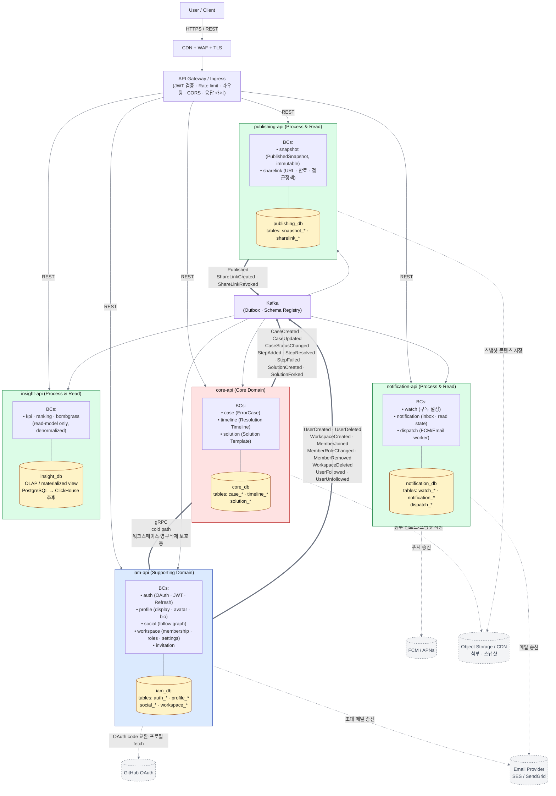

# error-archive Current Architecture (5-service)

현재 채택한 마이크로서비스 구성, DB 분리 정책, 통신 패턴을 한 그림으로 정리한 문서.

> 목표 상태(Phase 4) 아키텍처는 [`architecture-overview.md`](./architecture-overview.md), 권장사항/근거는 [`architecture-recommendations.md`](./architecture-recommendations.md) 참고.

---

## 1. 한 줄 요약

- **5 마이크로서비스**: `iam-api`, `core-api`, `publishing-api`, `notification-api`, `insight-api`
- **DB는 서비스 단위로 분리** (5 DB). 같은 서비스 안 BC들은 같은 DB 공유 + 테이블 prefix로 소유권 표현.
- **외부 공개 API**: REST + JSON
- **내부 동기 호출**: gRPC + ProtoBuf
- **비동기 이벤트**: Kafka (Process & Read 도메인이 주 컨슈머)

---

## 2. 시스템 다이어그램



### 다이어그램 범례

| 표기 | 의미 |
|---|---|
| 실선 화살표 | 방향성 있는 의존(REST 호출 또는 데이터 흐름) |
| `===` 두꺼운 화살표 | 내부 동기 호출 (gRPC) |
| `==>` 굵은 화살표 | 비동기 이벤트 발행 (Kafka) |
| 점선 화살표 | 외부 SaaS 의존 |

---

## 3. 마이크로서비스별 BC 정리

| Service | 도메인 분류 | 포함 BC | 분리 근거 |
|---|---|---|---|
| **iam-api** | Supporting | auth · profile · social · workspace · invitation | 사용자/팀 관리. 함께 호출되는 빈도 매우 높음 → 통합 운영. |
| **core-api** | Core | case · timeline · solution | 본 서비스의 차별화 가치. 한 사용자 흐름에서 같이 변경됨. |
| **publishing-api** | Process & Read | snapshot · sharelink | 공개 read 트래픽 격리 (CDN/edge cache 정책 분리). |
| **notification-api** | Process & Read | watch · notification · dispatch | 외부 SaaS(FCM·Email) 장애 격리 + 비동기 워크로드. |
| **insight-api** | Process & Read | kpi · ranking · bombgrass | OLAP 워크로드 격리. 자체 read 모델, 다른 서비스에 동기 호출 X. |

---

## 4. DB 분리 정책

### 4.1 단위
**마이크로서비스 단위로 분리**. 즉 **5개 DB**.

```
iam_db
core_db
publishing_db
notification_db
insight_db
```

### 4.2 같은 서비스 안의 BC 격리
같은 DB 안에서 **테이블 prefix**로 BC 소유권을 표현합니다.

예시 — `iam_db`:
```
auth_user                      ← auth BC
auth_credential
auth_refresh_token

profile_user_profile           ← profile BC

social_follow                  ← social BC

workspace_workspace            ← workspace BC
workspace_member
workspace_invitation
```

### 4.3 운영 규칙

| 규칙 | 내용 |
|---|---|
| 다른 서비스 DB 접근 | **절대 금지**. REST(외부) 또는 gRPC(내부) 또는 Kafka 이벤트만. |
| 같은 서비스 다른 BC 테이블 매핑 | 도메인 import 금지. port 경유(ACL 패턴). |
| FK 제약 | **같은 BC 안만** hard FK. cross-BC는 소프트 참조(ID만). |
| 마이그레이션 | 서비스별 Flyway/Liquibase. 각 서비스 배포 파이프라인이 책임. |
| 백업/암호화 | 서비스별 정책. iam_db는 PII로 가장 엄격. |

### 4.4 BC 단위가 아닌 이유

- **BC당 DB 분리하면** 운영비 4배, 같은 서비스 안의 한 흐름조차 분산 트랜잭션 → 형식적 만족만, 실제 격리 가치 없음.
- **마이크로서비스 단위 분리에서** 진짜 격리 가치 발생: 장애·백업·스케일·DB 엔진 다양화.

### 4.5 미래에 BC를 별도 서비스로 분리할 때
같은 서비스의 한 BC를 떼어내야 한다면(예: workspace를 별도 서비스로):
1. 기존 `iam_db`에서 `workspace_*` 테이블만 새 `workspace_db`로 마이그레이션.
2. 코드에서 ACL 어댑터를 in-process → gRPC 클라이언트로 교체.
3. 도메인 이벤트 컨슈머는 그대로(Kafka 통해 이미 분리됨).

테이블 prefix와 ACL 덕분에 마이그레이션 비용이 작음.

---

## 5. 통신 패턴

### 5.1 외부 → 시스템: REST + JSON

| 항목 | 내용 |
|---|---|
| 프로토콜 | HTTP/1.1 또는 HTTP/2, JSON 본문 |
| 인증 | JWT Bearer (gateway에서 1차 검증) |
| 명세 | OpenAPI 3.x, Swagger UI 노출 |
| 버저닝 | URL prefix `/api/v1/...` |
| 에러 | RFC 7807 ProblemDetail |

이유: 브라우저/모바일/외부 파트너가 가장 쉽게 소비. JSON은 디버깅 친화적, 캐시 친화적, 표준 도구 풍부.

### 5.2 서비스 ↔ 서비스 (동기): gRPC + ProtoBuf

| 항목 | 내용 |
|---|---|
| 프로토콜 | HTTP/2, ProtoBuf 직렬화 |
| 계약 관리 | `.proto` 파일을 별도 git 저장소(`error-archive-protos`) 또는 `error-archive/protos/` 디렉터리. 각 서비스가 빌드 타임 코드 생성 |
| 인증 | mTLS + 서비스 토큰. 또는 JWT propagation |
| 사용처 | **꼭 필요한 동기 호출만**. cold path 보호, 즉시 응답 필요한 read 검증 |
| 회복성 | Resilience4j circuit breaker, retry with jitter, timeout 강제 |

이유:
- 내부 호출은 latency·payload 크기 민감 → ProtoBuf 효율
- 강타입 계약 → 호환성 명시적
- streaming/bidirectional 지원으로 미래 사용 가능
- HTTP/2 multiplexing으로 connection 효율

### 5.3 서비스 → 서비스 (비동기): Kafka 이벤트

| 항목 | 내용 |
|---|---|
| 브로커 | Kafka (또는 매니지드: Confluent Cloud, AWS MSK) |
| 직렬화 | Avro 또는 ProtoBuf + Schema Registry |
| 신뢰성 | **Outbox 패턴**: DB 트랜잭션 + outbox 테이블 INSERT, 별도 publisher가 Kafka 송신 |
| 컨슈머 책임 | **idempotent**(eventId 기반 중복 제거). at-least-once delivery 가정 |
| 토픽 네이밍 | `<bc>.<aggregate>.<event-name>` 예: `workspace.member.joined`, `case.case.created` |
| 버저닝 | 토픽명 또는 스키마 메타에 `v1`, `v2`. backward-compatible 유지 |

이벤트가 적합한 BC들 (다이어그램의 굵은 화살표):
- **iam-api**: 사용자/멤버/팔로우 사건 발행 → noti/insight 구독
- **core-api**: 케이스/타임라인 사건 발행 → noti/insight/publishing 구독
- **publishing-api**: 발행/공유링크 사건 → noti/insight 구독

### 5.4 같은 서비스 안 BC 협력: in-process port

도메인 모델을 import하지 않고, application port + ACL 어댑터로 협력.
현재 `MemberSummaryReaderPort`(workspace ← auth)가 그 패턴.

---

## 6. 통신 매트릭스

각 서비스가 어떤 방식으로 누구와 통신하는가:

| 발신 ↓ \ 수신 → | iam | core | publishing | notification | insight | external |
|---|:-:|:-:|:-:|:-:|:-:|:-:|
| **iam** | — | — | — | — | — | GitHub OAuth, Email |
| **core** | gRPC(cold) | — | — | — | — | Object Storage |
| **publishing** | — | — | — | — | — | Object Storage |
| **notification** | — | — | — | — | — | FCM/APNs, Email |
| **insight** | — | — | — | — | — | — |
| **이벤트(Kafka)** | iam → bus | core → bus | pub → bus | (consume only) | (consume only) | — |
| **이벤트 구독** | bus(일부) | bus(일부) | bus(일부) | bus | bus | — |

요점:
- 동기 호출은 거의 없음 (gRPC `core → iam` cold path 1개).
- 모든 협력은 Kafka 이벤트.
- insight는 **순수 컨슈머**. 다른 서비스에 절대 동기 호출 X.

---

## 7. 인프라 구성 (운영 시)

| 컴포넌트 | 수량 | 비고 |
|---|---|---|
| API server (Spring Boot) | 5 + auto-scaling | iam, core, publishing, notification, insight |
| DB (PostgreSQL) | 5 인스턴스 (또는 1 인스턴스의 5 DB, 단계별 결정) | 운영 시 격리 강화 |
| Kafka cluster | 1 (3 broker 이상) | Schema Registry 포함 |
| Redis (cache/session) | 1 (cluster mode) | 토큰 캐시, rate limit |
| Object Storage | S3 또는 GCS | 첨부, 스냅샷 |
| CDN | CloudFront / CloudFlare | publishing 앞단 |
| API Gateway | Spring Cloud Gateway / Nginx / Kong | JWT 검증, 라우팅 |
| Service Mesh | (선택) Istio / Linkerd | mTLS, observability |
| Observability | OpenTelemetry + Tempo + Prometheus + Grafana | traceId 전파 필수 |

dev 환경에서는 H2/in-memory + 로컬 Kafka(redpanda) + docker-compose로 단순화.

---

## 8. 운영 횡단 패턴 (모든 서비스 공통)

| 패턴 | 적용 |
|---|---|
| **Outbox** | 이벤트 발행 atomic. DB 트랜잭션 + outbox 테이블 INSERT. |
| **Idempotency Key** | 모든 컨슈머. eventId UNIQUE INSERT로 중복 제거. |
| **Circuit Breaker** | gRPC 호출자. timeout + retry + fallback. |
| **Health Probe** | `/actuator/health/liveness`, `/readiness`. K8s probe 연결. |
| **Distributed Tracing** | OpenTelemetry. HTTP/gRPC/Kafka 전체에 traceId 전파. |
| **Schema Registry** | Avro/ProtoBuf. 이벤트 스키마 backward compatibility 강제. |
| **PII / Secret 관리** | Vault / Secrets Manager. 환경변수에 secret 절대 박지 않음. |

---

## 9. 점진 도입 단계

### Phase 1 — 현재 (코드 베이스 정리)
- iam-api, core-api 모듈 분리 ✅
- 각 모듈 안에 BC 디렉터리 분리 ✅
- 단일 DB(H2 dev), 테이블 prefix 적용

### Phase 2 — 운영 인프라
- 5 DB 분리 (운영용 PostgreSQL 인스턴스)
- API Gateway 도입
- OpenTelemetry 연결

### Phase 3 — 비동기 인프라
- Kafka cluster + Schema Registry
- Outbox 패턴 도입 (iam, core 먼저)
- notification/insight 컨슈머 작성

### Phase 4 — 분리 운영
- publishing-api, notification-api, insight-api 차례로 분리 배포
- gRPC 내부 호출 도입(필요 시)
- mTLS, service mesh 도입

각 Phase 진입 조건은 **"분리하지 않으면 진짜 아픈 지점이 있는가"**.

---

## 10. 한 줄 정리

**5 마이크로서비스 + 5 DB(서비스 단위 분리, BC는 prefix로 표현) + REST(외부) / gRPC(내부 sync) / Kafka(async).** 같은 서비스 안의 BC들은 같은 DB를 공유하되 도메인 import는 차단(ACL). 외부 노출 ID는 publicId(UUID), 내부는 Long으로 효율 우선.
