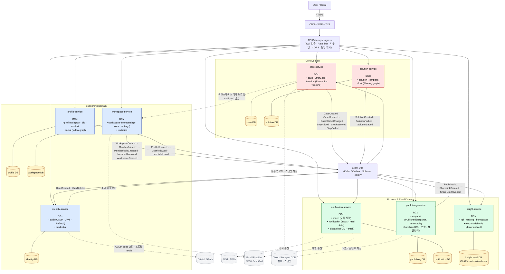

# error-archive Architecture Overview

전체 시스템의 마이크로서비스 구성과 BC 경계, 통신 패턴을 한 그림으로 정리한 문서.

> 이 다이어그램의 권장사항/근거는 [`architecture-recommendations.md`](./architecture-recommendations.md) 참고.

---

## 1. 현재 채택한 구조

---

## 2. 이전 다이어그램 대비 변경 사항

| # | 변경 | 이유 |
|---|---|---|
| 1 | **Timeline을 case-service 안의 BC로 통합** | timeline은 case 없이 의미 없음. 강한 트랜잭션 요구 + 트래픽 패턴 동일. deployment 단위는 합치되 BC 분리는 유지. |
| 2 | **Solution → Timeline 동기 호출 제거** | Solution은 재사용 가능한 템플릿. 특정 timeline step에 묶이면 재사용성 훼손. Solution은 Case(또는 fingerprint)에 직접 붙는다. |
| 3 | **CASE → WS, TL → CASE 동기 호출 제거** | 매 요청 동기 의존은 hot path 병목. AuthZ는 **JWT 클레임 + 이벤트 동기화**로 풀고, 동기 RPC는 cold path 보호 작업에만(점선). |
| 4 | **각 서비스의 자체 DB 명시** | DB-per-service. 다른 서비스 DB를 직접 읽지 않는다. |
| 5 | **외부 의존 명시** | GitHub OAuth(ID), FCM/APNs(NOTI), Email(NOTI · WS), Object Storage(CASE · PUB). 점선으로 표현. |
| 6 | **API Gateway 책임 명시** | JWT 검증 · Rate limit · 라우팅 · CORS · 응답 캐시. 각 서비스에서 중복 검증 방지. |
| 7 | **publishing-service 내부 BC 분리** | `snapshot`(불변 사본)과 `sharelink`(URL·만료·접근정책)는 일관성·정책이 다름. 같은 service 안에서도 BC로 구분. |
| 8 | **identity-service 내부 BC 분리** | `auth`(OAuth · JWT · Refresh)와 `credential`. PII/secret 격리 강조. |
| 9 | **profile-service 내부 BC 분리** | `profile`(displayName · bio · avatar)과 `social`(follow graph). |
| 10 | **insight-service의 read-model 전용 표기** | 자체 read DB(OLAP/materialized view) 보유. 이벤트 컨슈머 only, 다른 서비스에 동기 호출 없음. |
| 11 | **이벤트 흐름의 양방향 구독** | ID도 BUS를 구독(예: WS의 `MemberRoleChanged`로 토큰 family revoke). CASE도 일부 이벤트 구독(예: 워크스페이스 삭제 시 read 사본 정리). |

---

## 3. 통신 패턴 요약

### 3.1 동기 호출 (꼭 필요한 경우만)
- **API Gateway → 각 서비스**: 외부 클라이언트 진입점.
- **CASE → WS (cold path)**: 워크스페이스 영구 삭제 직전 보호 검증 등 드문 작업. 점선.

### 3.2 비동기 이벤트 (정상 경로의 BC 간 협력)
| 발행자 | 이벤트 | 주요 구독자 |
|---|---|---|
| identity | `UserCreated`, `UserDeleted` | profile, workspace, notification, insight |
| workspace | `WorkspaceCreated`, `MemberJoined`, `MemberRoleChanged`, `MemberRemoved`, `WorkspaceDeleted` | identity(토큰 갱신), case(권한 사본), notification, insight |
| profile | `ProfileUpdated`, `UserFollowed`, `UserUnfollowed` | notification, insight |
| case | `CaseCreated`, `CaseUpdated`, `CaseStatusChanged`, `StepAdded`, `StepResolved`, `StepFailed` | notification, insight, publishing |
| solution | `SolutionCreated`, `SolutionForked`, `SolutionSaved` | notification, insight |
| publishing | `Published`, `ShareLinkCreated`, `ShareLinkRevoked` | notification, insight |

### 3.3 외부 의존
| 서비스 | 외부 | 용도 |
|---|---|---|
| identity | GitHub OAuth | 코드 교환, 프로필 fetch |
| notification | FCM/APNs, Email | 푸시·메일 발송 |
| workspace | Email | 초대 메일 |
| case, publishing | Object Storage / CDN | 첨부·스냅샷 콘텐츠 |

---

## 4. 서비스별 BC 정리

| Service | BCs | 비고 |
|---|---|---|
| **case-service** | `case`, `timeline` | timeline은 case 없이 무의미 → 같은 서비스. BC만 분리. |
| **solution-service** | `solution`, `fork` | 재사용 템플릿 + 공유 그래프. |
| **identity-service** | `auth`, `credential` | OAuth/JWT/Refresh + secret 관리. |
| **profile-service** | `profile`, `social` | 표시 정보 + 팔로우 그래프. |
| **workspace-service** | `workspace`, `invitation` | 멤버십·역할·설정 + 초대 토큰. |
| **publishing-service** | `snapshot`, `sharelink` | 불변 공개본 + 접근 URL. |
| **notification-service** | `watch`, `notification`, `dispatch` | 구독·인박스·발송 채널. |
| **insight-service** | `kpi`, `ranking`, `bombgrass` | read-model only, 자체 OLAP DB. |

---

## 5. 운영 횡단 관심사 (모든 서비스 공통 적용)

- **Outbox 패턴**: 이벤트 발행은 DB 트랜잭션과 atomic.
- **Idempotency Key**: 모든 이벤트 컨슈머. 중복 처리 방지.
- **Circuit Breaker**: 동기 RPC 호출자. 다운스트림 장애 격리.
- **Health Check / Readiness**: K8s probe.
- **Distributed Tracing**: OpenTelemetry로 RPC + 이벤트까지 traceId 전파.
- **Schema Registry**: 이벤트 페이로드 스키마 버저닝.

자세한 권장 패턴은 [`architecture-recommendations.md`](./architecture-recommendations.md) 참고.
